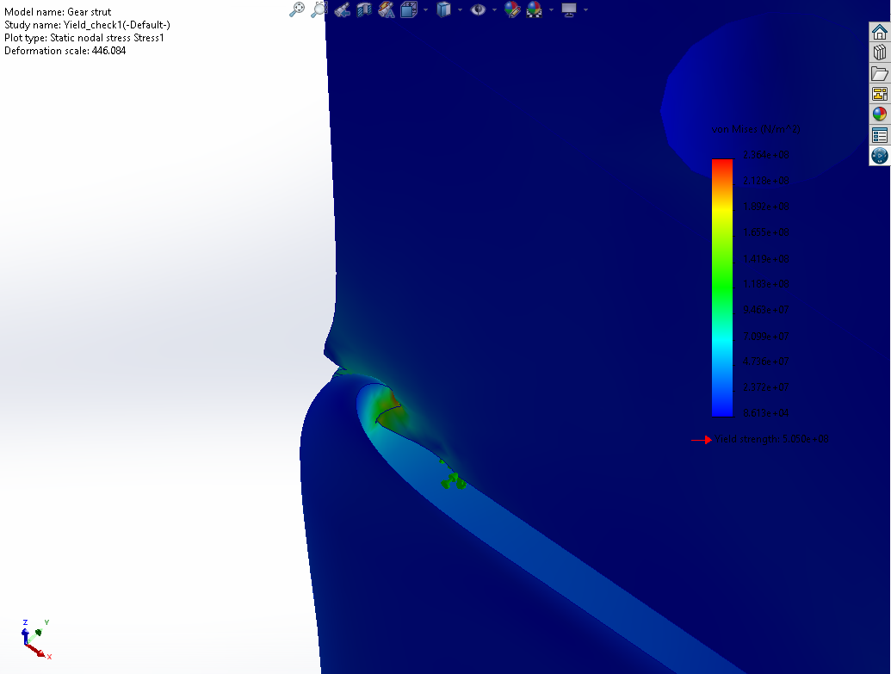
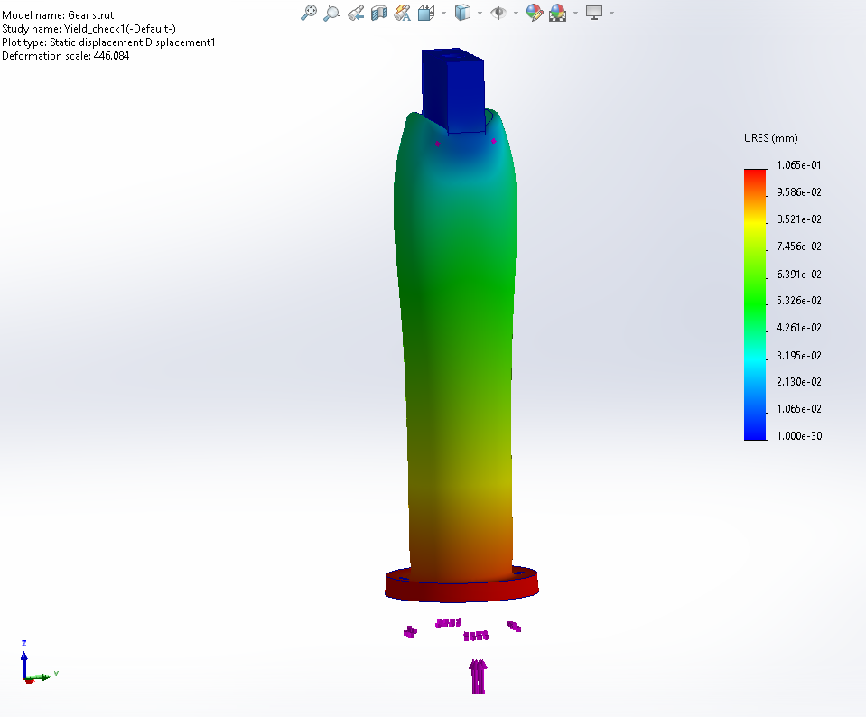
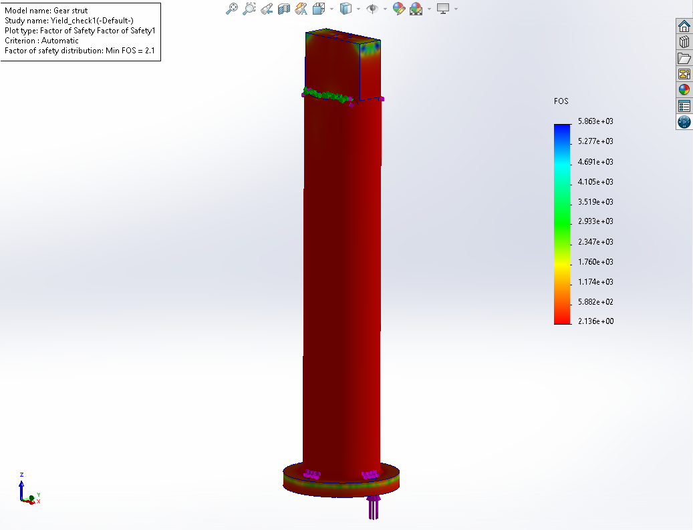
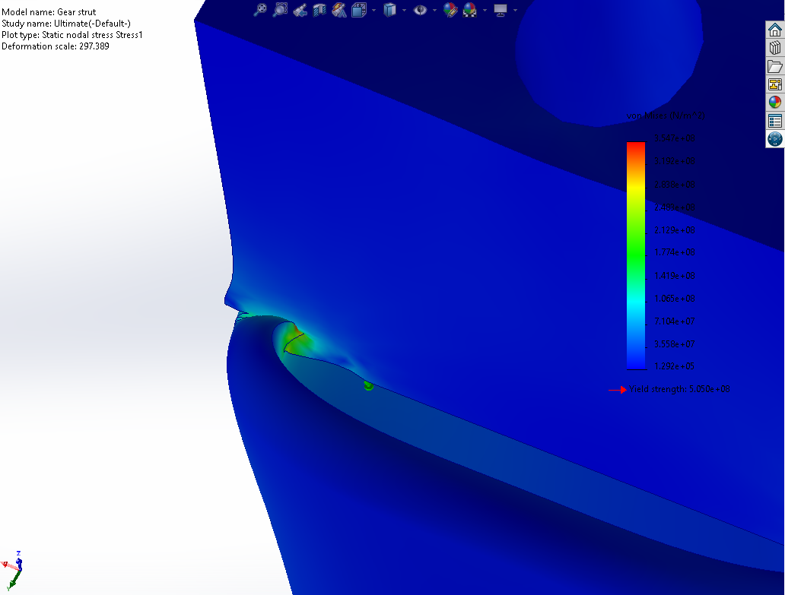
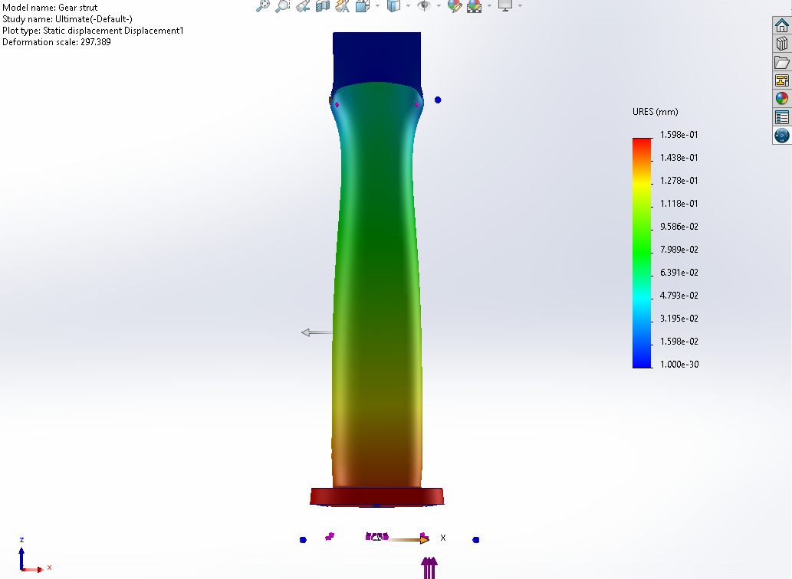
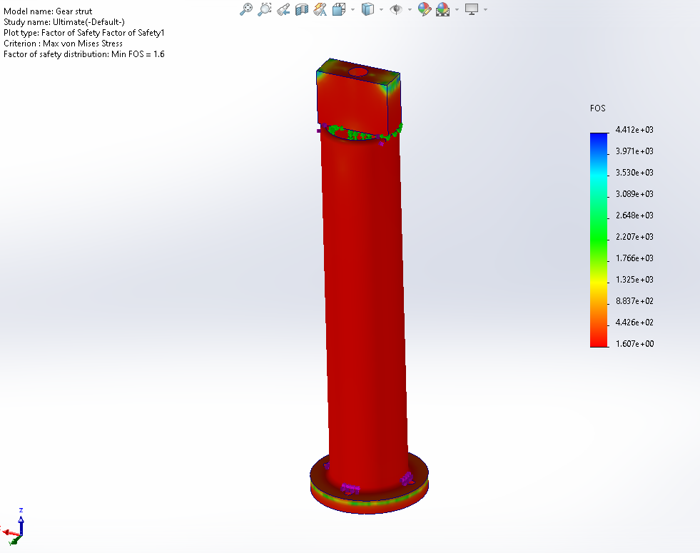
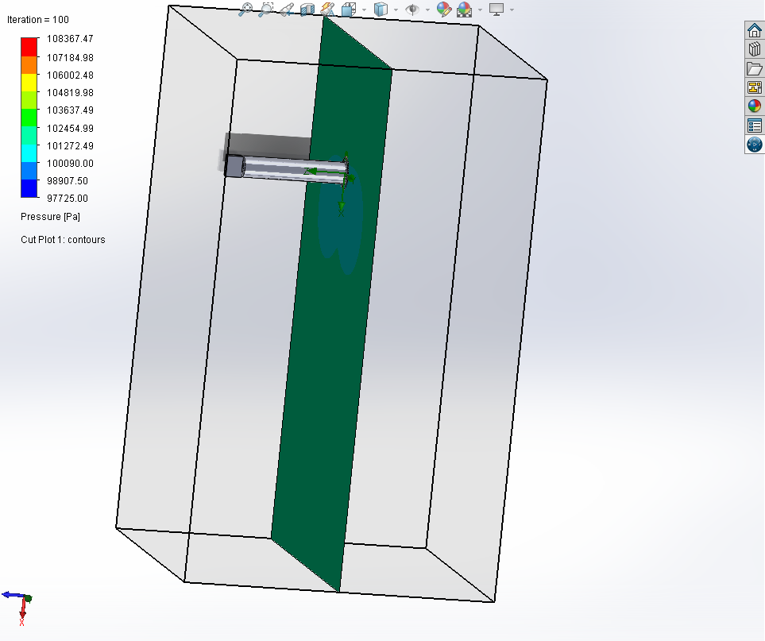
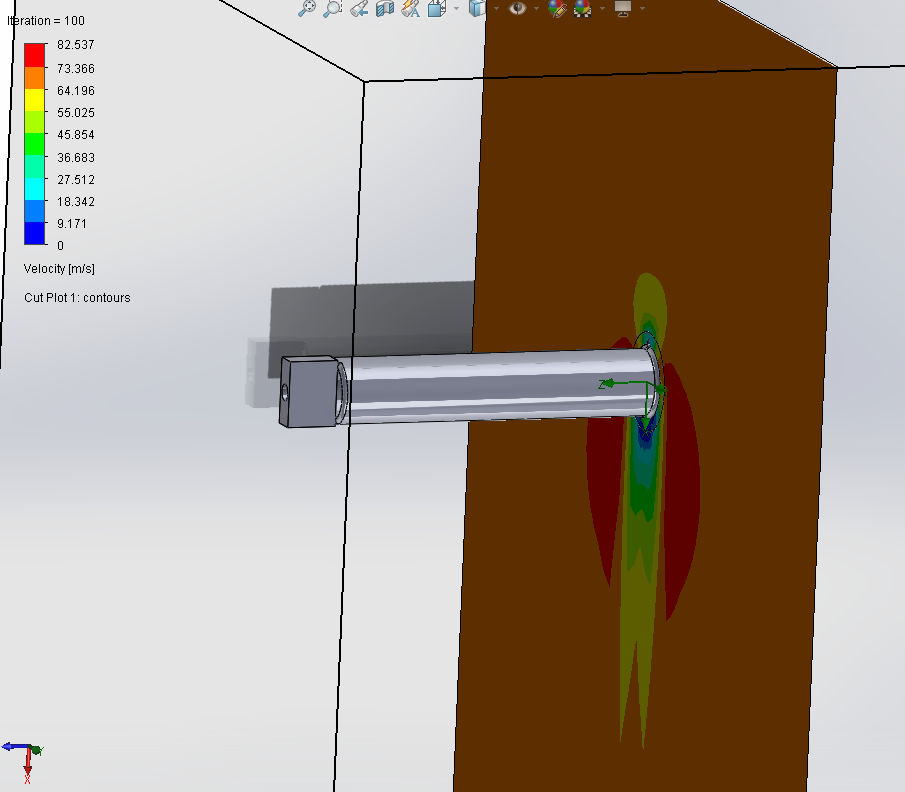
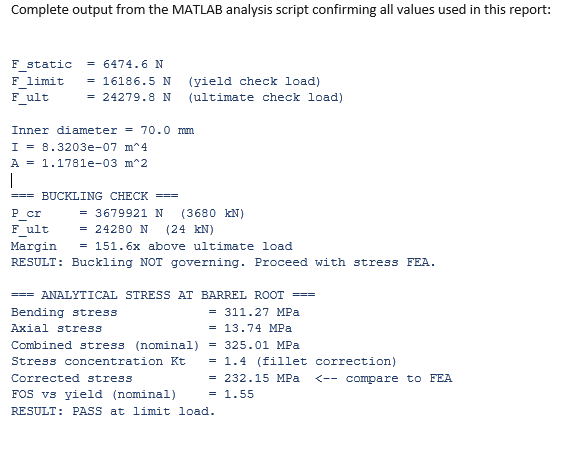

# Aircraft Landing Gear Strut Structural and Aerodynamic Analysis

**4th Semester Mechanical Engineering Project**

National University of Sciences and Technology (NUST)

June 2026

---

## Project Overview

Static linear-elastic FEA and external aerodynamic flow simulation 
of a simplified oleo-pneumatic main landing gear strut for a light 
general aviation aircraft (1,100 kg MTOW class).

Performed entirely in SolidWorks 2023 Simulation and Flow Simulation, 
with independent analytical validation in MATLAB.

---

## What Was Done

- Modeled the strut as a monolithic hollow aluminum part in SolidWorks
- Ran static FEA under two load cases: limit load (16,200 N) and 
  ultimate load (24,300 N)
- Validated FEA against analytical cantilever beam theory with stress 
  concentration correction (Kt = 1.4), 2% agreement achieved
- Ran external flow simulation at 70 m/s approach speed to extract 
  aerodynamic drag force
- Developed MATLAB parametric study sweeping wall thickness to generate 
  FOS vs mass design trade curves

---

## Key Results

| Parameter | Value |
|---|---|
| Peak stress at limit load (16,200 N) | 236 MPa |
| FOS at limit load | 2.14 |
| Peak stress at ultimate load (24,300 N) | 354.7 MPa |
| FOS at ultimate load | 1.61 |
| Aerodynamic drag at 70 m/s | 74 N |
| FEA vs analytical agreement | 2% |
| Buckling margin | 151.6x (non-governing) |

All results pass yield and fracture criteria for Al 7075-T6.

---

## Software

- SolidWorks 2023 (CAD, Static FEA, Flow Simulation)
- MATLAB / Octave (Load calculations, parametric study, validation)

---

## Material

Aluminum 7075-T6
- Yield strength: 505 MPa
- UTS: 570 MPa
- Young's modulus: 72,000 MPa

---

## Load Cases

| Run | Load | Criterion | Result |
|---|---|---|---|
| Run A | 16,200 N (limit) | Von Mises < 505 MPa | PASS |
| Run B | 24,300 N (ultimate) | Von Mises < 570 MPa | PASS |

---

## FEA Results

### Yield Check (16,200 N)

### Ultimate Check (24,300 N)

---

## Flow Simulation (70 m/s)

---

## MATLAB Output

---
## Report

---
## CAD File

---

## Author

Umair
Mechanical Engineering, NUST
umairamir1305@gmail.com
